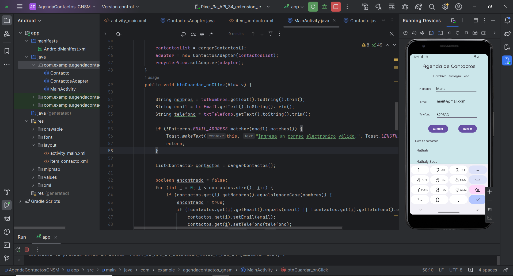
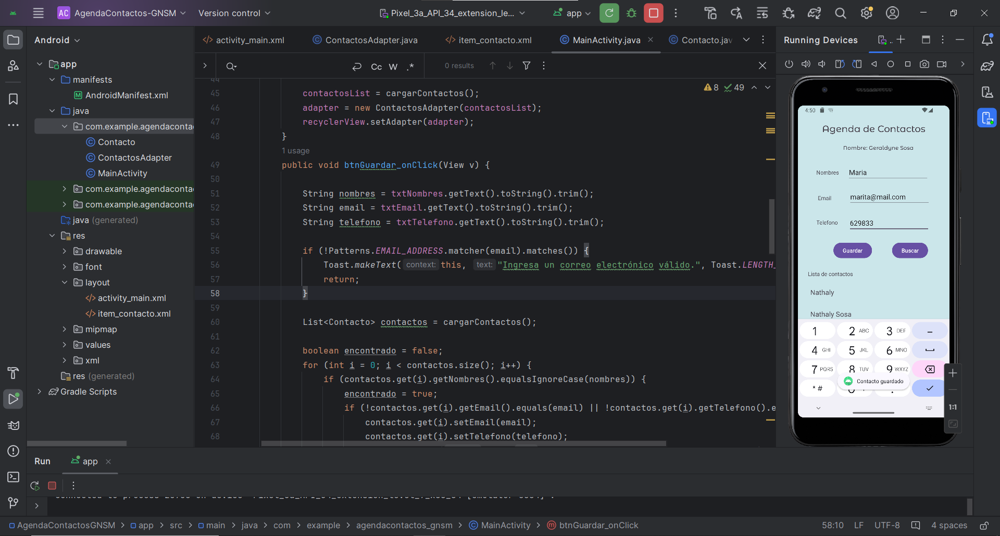
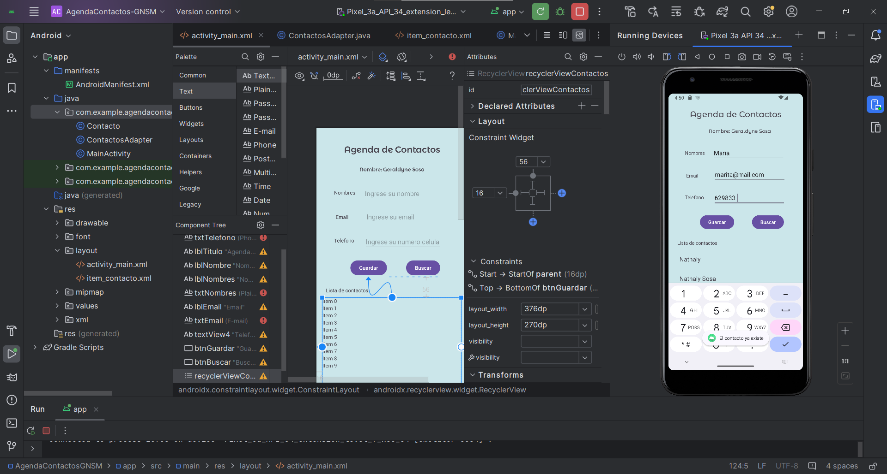
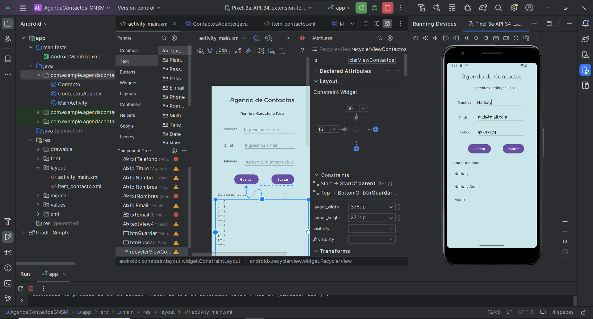
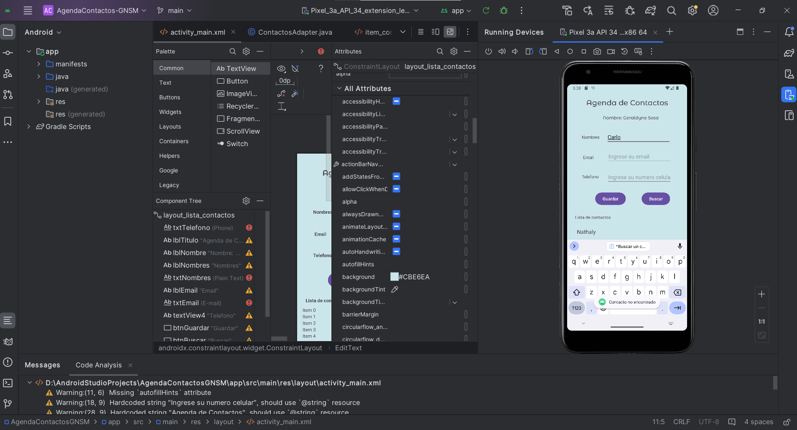
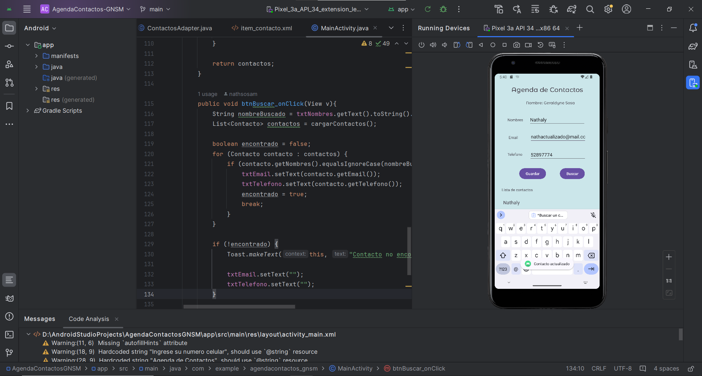

# Universidad Técnica del Norte - Agenda de Contactos GNSM

**Nombre:** Geraldyne Nathaly Sosa Mediavilla  
**Materia:** Aplicaciones Móviles
**Docente:** MSc. Diego Trejo

Este es un proyecto de una agenda de contactos para Android, como parte de la asignación de la materia de Aplicaciones móviles (UTN).

## Características

- Agregar nuevos contactos
- Buscar contactos existentes
- Visualizar la lista de contactos

## Capturas de Pantalla

Capturas de pantalla de la aplicación en acción:
*Pantalla de inicio de la Agenda de Contactos*

*Agregar un nuevo contacto*

*Agregar de nuevo un contacto previamente existente*

*Buscar un contacto existente y vista de lista de contactos*

*Usuario no encontrado*

*Actualizar información del contacto*

